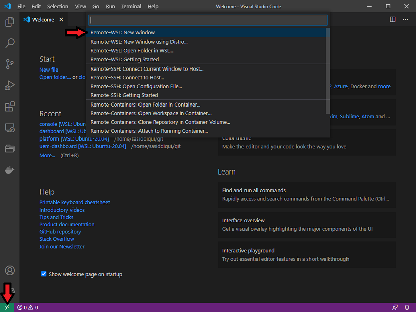
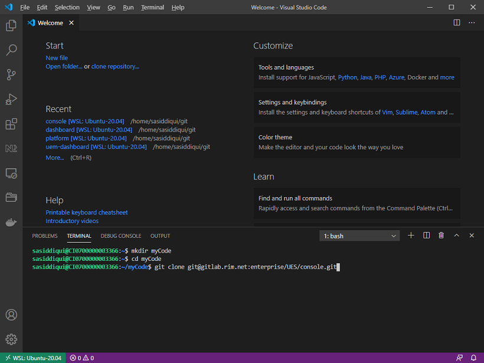

### Setup

1.  Install VS Code (in Windows): https://code.visualstudio.com/docs/setup/windows

2.  When first opening VS Code it will prompt you to install the Remote-WSL extension, install it now. It can be also be installed later via File -> Preferences -> Extensions and searching for Remote-WSL.

3.  Click the green button in the bottom status bar to open a new Remote-WSL window.
    

4.  In the new VS Code window select Terminal -> New Terminal

5.  Create a new directory of your choice and clone the console repo. For example
    

    ```
    git clone git@gitlab.rim.net:enterprise/UES/console.git
    ```

6.  Open the console workspace via File -> Open Folder
    ```
    /home/<username>/<directoryname>/console/
    ```

### Suggested Extensions

- See [extensions.json](./.vscode/extensions.json) for the list of "Suggested Extensions"

- If you wish to use the ESLint extension, you may need to allow it's execution

      If you see the following:

  

      Click the red text and select "Allow" or "Allow Everywhere". See [HERE](https://github.com/microsoft/vscode-eslint/issues/1086#issuecomment-706555923) for more details.

### Settings

See [settings.json](./.vscode/settings.json) and [prettierrc](./.prettierrc) for suggested settings
