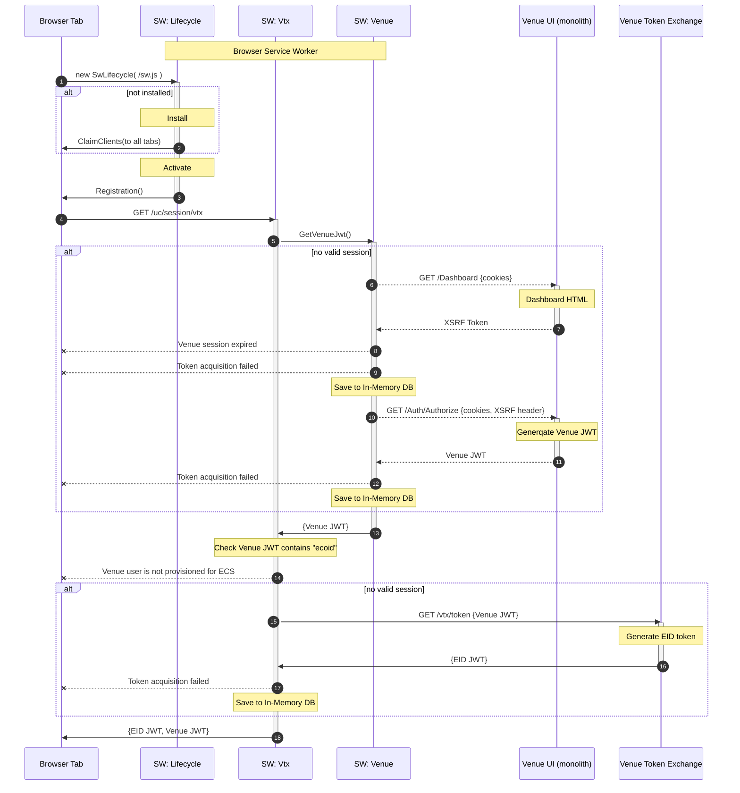

## Browser Sessions for Cronos

```mermaid
sequenceDiagram
	autonumber
	participant Browser as Browser Tab
  participant SwLifecycle as SW: Lifecycle
  participant SwVtx as SW: Vtx
  participant SwVenue as SW: Venue
  participant VenueUI as Venue UI (monolith)
	participant Vtx as Venue Token Exchange

  Note over SwLifecycle, SwVenue: Browser Service Worker

  ## 0.  Registration
  Browser->>SwLifecycle: new SwLifecycle( /sw.js )
  activate SwLifecycle
  alt not installed
    Note over SwLifecycle: Install
    SwLifecycle->>Browser: ClaimClients(to all tabs)
  end
  Note over SwLifecycle: Activate
  SwLifecycle->>Browser: Registration()
  deactivate SwLifecycle

  ## 1.  Request Session
  Browser->>SwVtx: GET /uc/session/vtx
  activate SwVtx
  # Note over SwLifecycle: Default behaviour

  SwVtx->>SwVenue: GetVenueJwt()
  activate SwVenue

  alt no valid session

    ## 1.1.  VenueUI XSRF Token
    SwVenue-->>VenueUI: GET /Dashboard {cookies}
    activate VenueUI
    Note over VenueUI: Dashboard HTML
    VenueUI-->>SwVenue: XSRF Token
    deactivate VenueUI
    SwVenue--xBrowser: Venue session expired
    SwVenue--xBrowser: Token acquisition failed
    Note over SwVenue: Save to In-Memory DB

    ## 1.2.  VenueUI JWT
    SwVenue-->>VenueUI: GET /Auth/Authorize {cookies, XSRF header}
    activate VenueUI
    Note over VenueUI: Generqate Venue JWT
    VenueUI-->>SwVenue: Venue JWT
    deactivate VenueUI
    SwVenue--xBrowser: Token acquisition failed
    Note over SwVenue: Save to In-Memory DB

  end

  SwVenue->>SwVtx: {Venue JWT}
  deactivate SwVenue

  Note over SwVtx: Check Venue JWT contains "ecoid"
  SwVtx--xBrowser: Venue user is not provisioned for ECS

  alt no valid session
    	## 3.  Venue Token Exchange
    SwVtx->>Vtx: GET /vtx/token {Venue JWT}
    activate Vtx
    Note over Vtx: Generate EID token
    Vtx->>SwVtx: {EID JWT}
    deactivate Vtx
    SwVtx--xBrowser: Token acquisition failed
    Note over SwVtx: Save to In-Memory DB

  end

  SwVtx->>Browser: {EID JWT, Venue JWT}
  deactivate SwVtx

```
