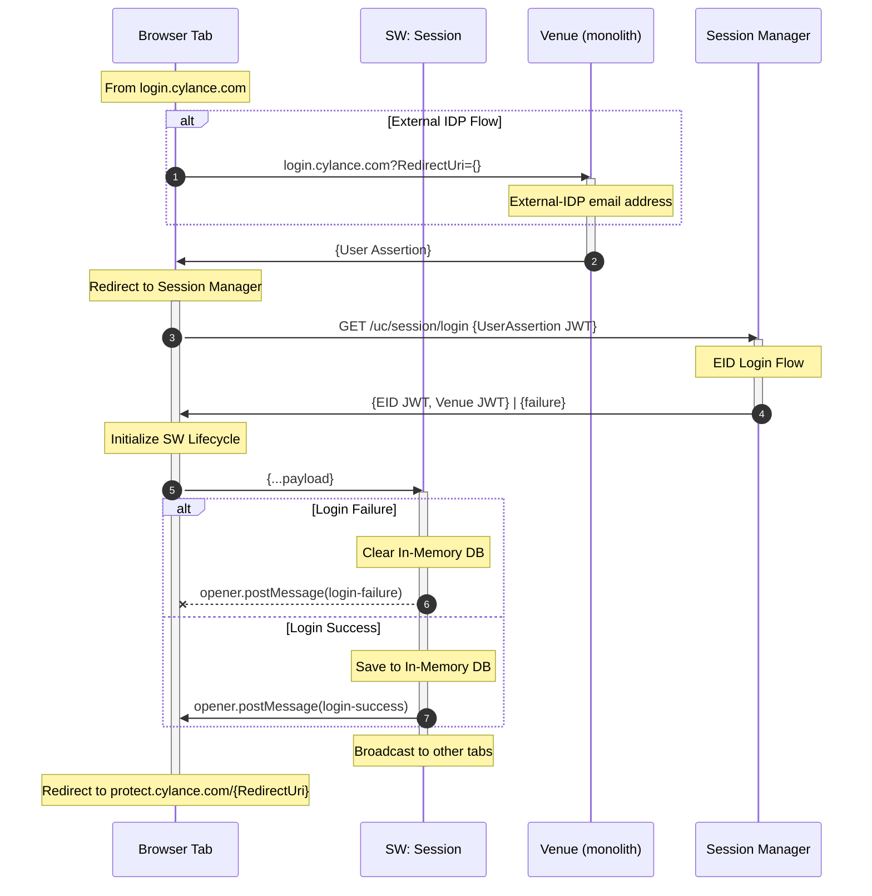

# Browser Sessions for Daedalus

## Console Load Flow

### 1. Session State Initialization

executed when pages load in the browser from

- ues-nav injected into venue
- ues-console session provider
- login/logout flow completion views

### 2. **SSO Flow**

used for Local User and External IDP flows when there is _no active session_

### 3. **Local User Login Flow**

used for Local User flow when _sso fails_

### 3. **External IDP and Ghost Login Flow**

used for External IDP flow when _sso fails_ and Ghost Login flow from MTC

## Logout Flow

