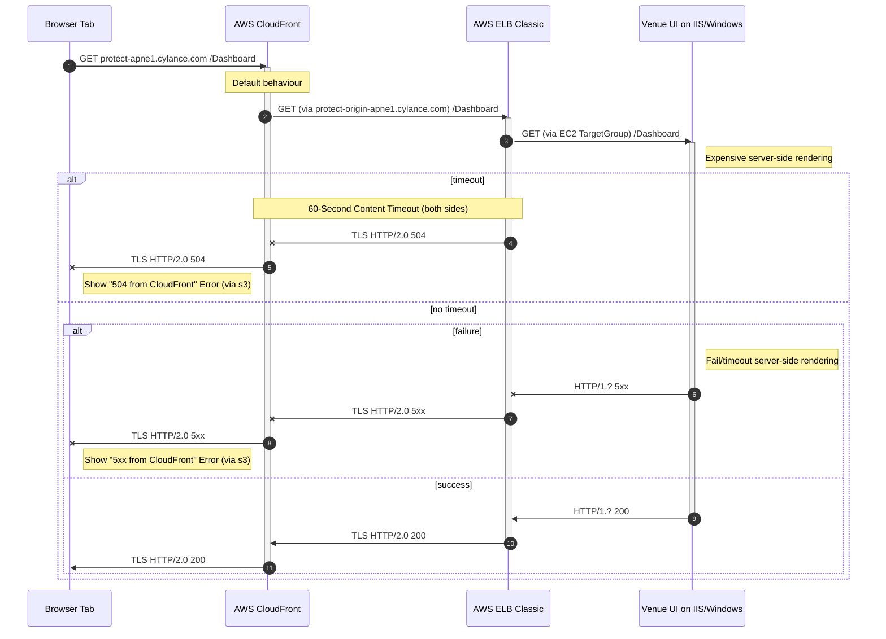

## CloudFront Delivery Architecture

```mermaid
sequenceDiagram
	autonumber
	participant Browser as Browser Tab
  participant CloudFront as AWS CloudFront
	participant Elb as AWS ELB Classic
  participant VenueUI as Venue UI on IIS/Windows

  ## 1.  Incoming Request
  Browser->>CloudFront: GET protect-apne1.cylance.com /Dashboard
  activate CloudFront
  Note over CloudFront: Default behaviour

  CloudFront->>Elb: GET (via protect-origin-apne1.cylance.com) /Dashboard
  activate Elb
	Elb->>VenueUI: GET (via EC2 TargetGroup) /Dashboard

  ## 2.  Venue
	activate VenueUI
  Note right of VenueUI: Expensive server-side rendering
  alt timeout
    Note over CloudFront, Elb: 60-Second Content Timeout (both sides)

    Elb-xCloudFront: TLS HTTP/2.0 504
    CloudFront-xBrowser: TLS HTTP/2.0 504
    Note right of Browser: Show "504 from CloudFront" Error (via s3)

	else no timeout

    alt failure
      Note right of VenueUI: Fail/timeout server-side rendering

      VenueUI-xElb: HTTP/1.? 5xx
      Elb-xCloudFront: TLS HTTP/2.0 5xx
      CloudFront-xBrowser: TLS HTTP/2.0 5xx
      Note right of Browser: Show "5xx from CloudFront" Error (via s3)

    else success

      VenueUI->>Elb: HTTP/1.? 200
      deactivate VenueUI
      ## 3.  Outgoing Response
      Elb->>CloudFront: TLS HTTP/2.0 200
      deactivate Elb
      CloudFront->>Browser: TLS HTTP/2.0 200
      deactivate CloudFront

    end

  end

```
