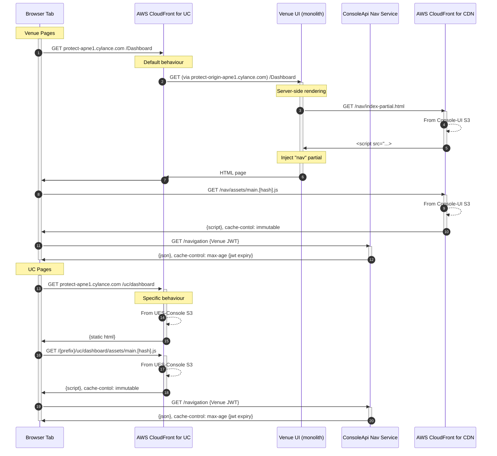

## Navigation Experience

```mermaid
sequenceDiagram
	autonumber
	participant Browser as Browser Tab
  participant CloudFront as AWS CloudFront for UC
  participant VenueUI as Venue UI (monolith)
  participant Nav as ConsoleApi Nav Service
  participant CyCdn as AWS CloudFront for CDN

  ## 1.1.  Venue Page Static
  Note over Browser: Venue Pages
  activate Browser
  Browser->>CloudFront: GET protect-apne1.cylance.com /Dashboard
  activate CloudFront
  Note over CloudFront: Default behaviour

  CloudFront->>VenueUI: GET (via protect-origin-apne1.cylance.com) /Dashboard
  activate VenueUI

  Note over VenueUI: Server-side rendering
  VenueUI->>CyCdn: GET /nav/index-partial.html
  activate CyCdn
  CyCdn-->>CyCdn: From Console-UI S3
  CyCdn->>VenueUI: <script src="...>
  deactivate CyCdn
  Note over VenueUI: Inject "nav" partial

  VenueUI->>CloudFront: HTML page
  deactivate VenueUI
  CloudFront->>Browser: ;

  ## 1.2. Venue Page Dynamic
  Browser->>CyCdn: GET /nav/assets/main.[hash].js
  activate CyCdn
  CyCdn-->>CyCdn: From Console-UI S3
  CyCdn->>Browser: {script}, cache-contol: immutable
  deactivate CyCdn

  ## 1.3. Navigation json
  Browser->>Nav: GET /navigation {Venue JWT}
  activate Nav
  Nav->>Browser: {json}, cache-control: max-age {jwt expiry}
  deactivate Nav

  deactivate Browser

  ## 2.1.  UC Page Static
  Note over Browser: UC Pages
  activate Browser
  Browser->>CloudFront: GET protect-apne1.cylance.com /uc/dashboard
  activate CloudFront
  Note over CloudFront: Specific behaviour

  CloudFront-->>CloudFront: From UES-Console S3
  CloudFront->>Browser: {static html}
  deactivate CloudFront

  ## 2.2. Venue Page Dynamic
  Browser->>CloudFront: GET /{prefix}/uc/dashboard/assets/main.[hash].js
  activate CloudFront
  CloudFront-->>CloudFront: From UES-Console S3
  CloudFront->>Browser: {script}, cache-contol: immutable
  deactivate CloudFront

  ## 1.3. Navigation json
  Browser->>Nav: GET /navigation {Venue JWT}
  activate Nav
  Nav->>Browser: {json}, cache-control: max-age {jwt expiry}
  deactivate Nav

  deactivate Browser

```
