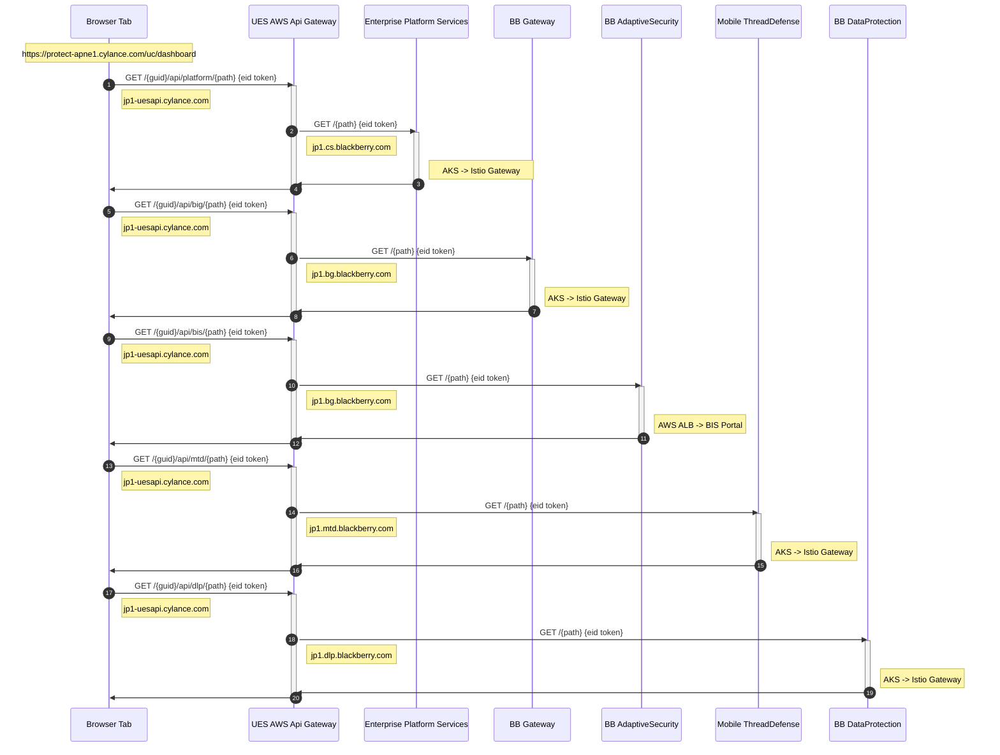

## UES API Calls to BB Pillars (in **jp1** region)

```mermaid
sequenceDiagram
	autonumber
	participant Browser as Browser Tab
  participant UesApi as UES AWS Api Gateway
	participant EntPS as Enterprise Platform Services
	participant Big as BB Gateway
	participant Bis as BB AdaptiveSecurity
	participant Mtd as Mobile ThreadDefense
	participant Dlp as BB DataProtection

  Note over Browser: https://protect-apne1.cylance.com/uc/dashboard

  ## 1.  EntPS
	Browser->>UesApi: GET /{guid}/api/platform/{path} {eid token}
	activate UesApi
  Note right of Browser: jp1-uesapi.cylance.com
	UesApi->>EntPS: GET /{path} {eid token}
	activate EntPS
  Note right of UesApi: jp1.cs.blackberry.com
	Note right of EntPS: AKS -> Istio Gateway
	EntPS->>UesApi: ;
	deactivate EntPS
  UesApi->>Browser: ;
  deactivate UesApi

  ## 2.  Big
	Browser->>UesApi: GET /{guid}/api/big/{path} {eid token}
	activate UesApi
  Note right of Browser: jp1-uesapi.cylance.com
	UesApi->>Big: GET /{path} {eid token}
	activate Big
  Note right of UesApi: jp1.bg.blackberry.com
	Note right of Big: AKS -> Istio Gateway
	Big->>UesApi: ;
	deactivate Big
  UesApi->>Browser: ;
  deactivate UesApi

  ## 3.  Bis
	Browser->>UesApi: GET /{guid}/api/bis/{path} {eid token}
	activate UesApi
  Note right of Browser: jp1-uesapi.cylance.com
	UesApi->>Bis: GET /{path} {eid token}
	activate Bis
  Note right of UesApi: jp1.bg.blackberry.com
	Note right of Bis: AWS ALB -> BIS Portal
	Bis->>UesApi: ;
	deactivate Bis
  UesApi->>Browser: ;
  deactivate UesApi

  ## 2.  Mtd
	Browser->>UesApi: GET /{guid}/api/mtd/{path} {eid token}
	activate UesApi
  Note right of Browser: jp1-uesapi.cylance.com
	UesApi->>Mtd: GET /{path} {eid token}
	activate Mtd
  Note right of UesApi: jp1.mtd.blackberry.com
	Note right of Mtd: AKS -> Istio Gateway
	Mtd->>UesApi: ;
	deactivate Mtd
  UesApi->>Browser: ;
  deactivate UesApi

  ## 2.  Dlp
	Browser->>UesApi: GET /{guid}/api/dlp/{path} {eid token}
	activate UesApi
  Note right of Browser: jp1-uesapi.cylance.com
	UesApi->>Dlp: GET /{path} {eid token}
	activate Dlp
  Note right of UesApi: jp1.dlp.blackberry.com
	Note right of Dlp: AKS -> Istio Gateway
	Dlp->>UesApi: ;
	deactivate Dlp
  UesApi->>Browser: ;
  deactivate UesApi

```
