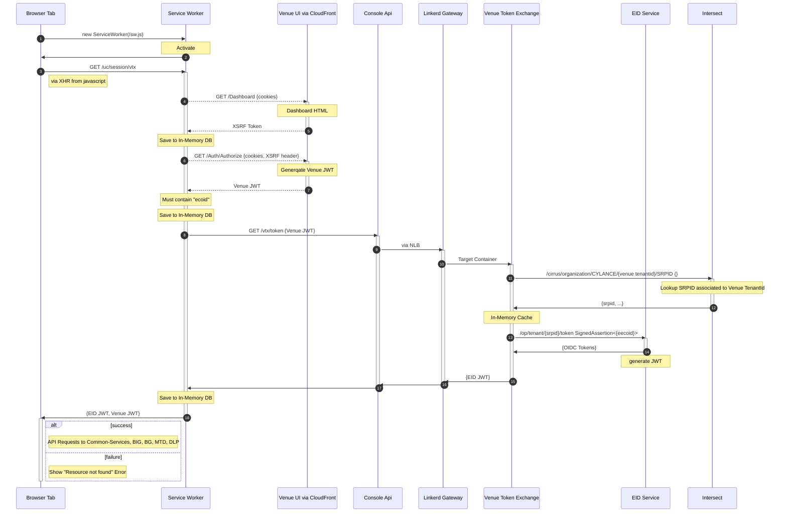

## Venue Token Exchange flow

```mermaid
sequenceDiagram
	autonumber
	participant Browser as Browser Tab
  participant ServiceWorker as Service Worker
	participant VenueUI as Venue UI via CloudFront
	participant ConsoleApi as Console Api
	participant Linkerd as Linkerd Gateway
	participant Vtx as Venue Token Exchange
	participant Eid as EID Service
	participant Intersect as Intersect

  ## 0. Initiate Page
  Browser->>ServiceWorker: new ServiceWorker(/sw.js)
  Note over ServiceWorker: Activate
  ServiceWorker->>Browser: ;
	Browser->>ServiceWorker: GET /uc/session/vtx
	activate ServiceWorker
  Note right of Browser: via XHR from javascript

	## 1.  VenueUI XSRF Token
	ServiceWorker-->>VenueUI: GET /Dashboard {cookies}
	activate VenueUI
	Note over VenueUI: Dashboard HTML
	VenueUI-->>ServiceWorker: XSRF Token
	deactivate VenueUI
  Note over ServiceWorker: Save to In-Memory DB

	## 2.  VenueUI JWT
	ServiceWorker-->>VenueUI: GET /Auth/Authorize {cookies, XSRF header}
	activate VenueUI
	Note over VenueUI: Generqate Venue JWT
	VenueUI-->>ServiceWorker: Venue JWT
	deactivate VenueUI
  Note over ServiceWorker: Must contain "ecoid"
  Note over ServiceWorker: Save to In-Memory DB

	## 3.  Venue Token Exchange
	ServiceWorker->>ConsoleApi: GET /vtx/token {Venue JWT}
	activate ConsoleApi
	ConsoleApi->>Linkerd: via NLB
	activate Linkerd
	Linkerd->>Vtx: Target Container
	activate Vtx
  Vtx->>Intersect: /cirrus/organization/CYLANCE/{venue tenantid}/SRPID {}
  activate Intersect
  note over Intersect: Lookup SRPID associated to Venue TenantId
  Intersect->>Vtx: {srpid, ...}
  deactivate Intersect
  Note over Vtx: In-Memory Cache
  Vtx->>Eid: /op/tenant/{srpid}/token SignedAssertion<{eecoid}>
  activate Eid
  Eid->>Vtx: {OIDC Tokens}
  Note over Eid: generate JWT
  deactivate Eid
	Vtx->>Linkerd: {EID JWT}
	deactivate Vtx
	Linkerd->>ConsoleApi: ;
	deactivate Linkerd
	ConsoleApi->>ServiceWorker: ;
	deactivate ConsoleApi
  Note over ServiceWorker: Save to In-Memory DB
	ServiceWorker->>Browser: {EID JWT, Venue JWT}
	deactivate ServiceWorker

  ## 4.  End
	activate Browser
	alt success
    Note right of Browser: API Requests to Common-Services, BIG, BG, MTD, DLP
	else failure
    Note right of Browser: Show "Resource not found" Error
	end
	deactivate Browser
```
