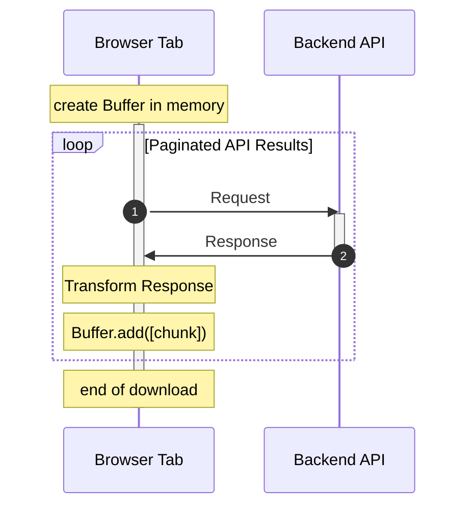

# SaveFilePicker Flow

Supports all chromium browsers

```mermaid
sequenceDiagram
	autonumber
	participant Tab as Browser Tab
	participant Api as Backend API
  Note over Tab: create Buffer in memory
  activate Tab
loop Paginated API Results
  Tab->>Api: Request
  activate Api
  Api->>Tab: Response
  deactivate Api
  Note over Tab: Transform Response
  Note over Tab: Buffer.add([chunk])
end

  Note over Tab: end of download
  deactivate Tab
```
