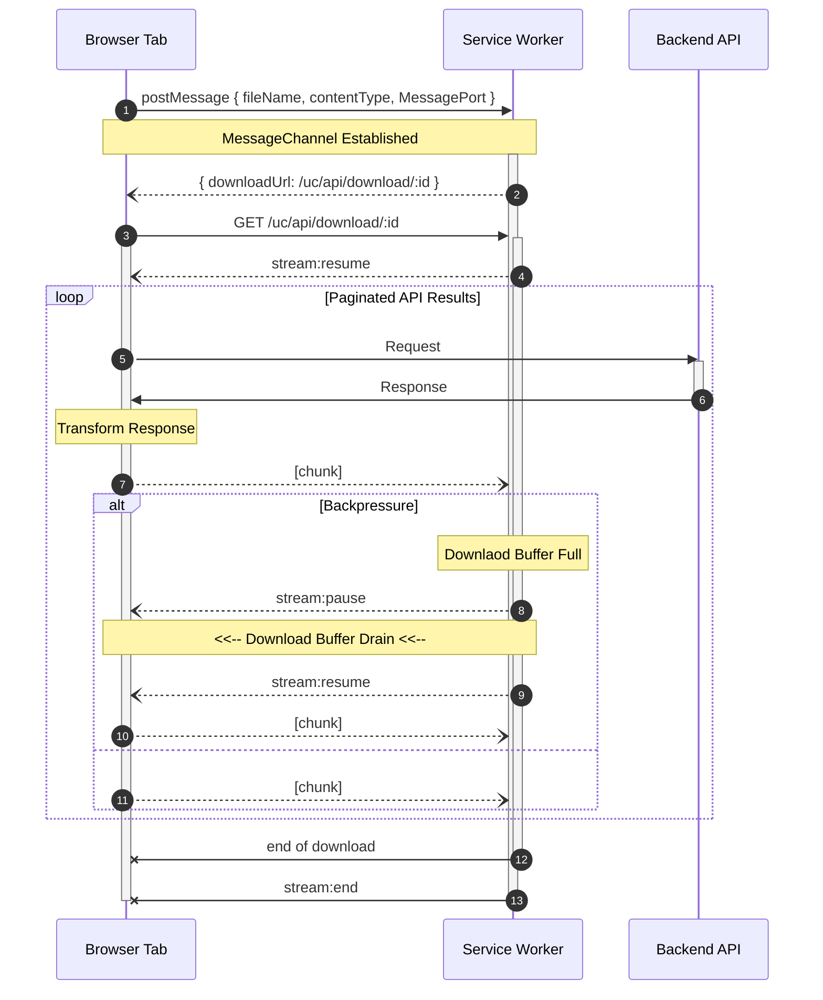

# Worker MessageStream Flow

Supports all browsers except AppleWebkit (see this [Webkit Bug](https://bugs.webkit.org/show_bug.cgi?id=202142))

```mermaid
sequenceDiagram
	autonumber
	participant Tab as Browser Tab
	participant Sw as Service Worker
	participant Api as Backend API
	Tab->>Sw: postMessage { fileName, contentType, MessagePort }
  Note over Tab,Sw: MessageChannel Established
  activate Sw
  Sw--)Tab: { downloadUrl: /uc/api/download/:id }
  Tab->>Sw: GET /uc/api/download/:id
  activate Tab
  activate Sw
  Sw--)Tab: stream:resume
loop Paginated API Results
  Tab->>Api: Request
  activate Api
  Api->>Tab: Response
  deactivate Api
  Note over Tab: Transform Response
  Tab--)Sw: [chunk]

alt Backpressure
  Note over Sw: Downlaod Buffer Full
  Sw--)Tab: stream:pause
  Note over Tab,Sw: <<-- Download Buffer Drain <<--
  Sw--)Tab: stream:resume
  Tab--)Sw: [chunk]
else
  Tab--)Sw: [chunk]
end

end

  Sw-xTab: end of download
  deactivate Sw
  Sw-xTab: stream:end
  deactivate Tab
  deactivate Sw
```
